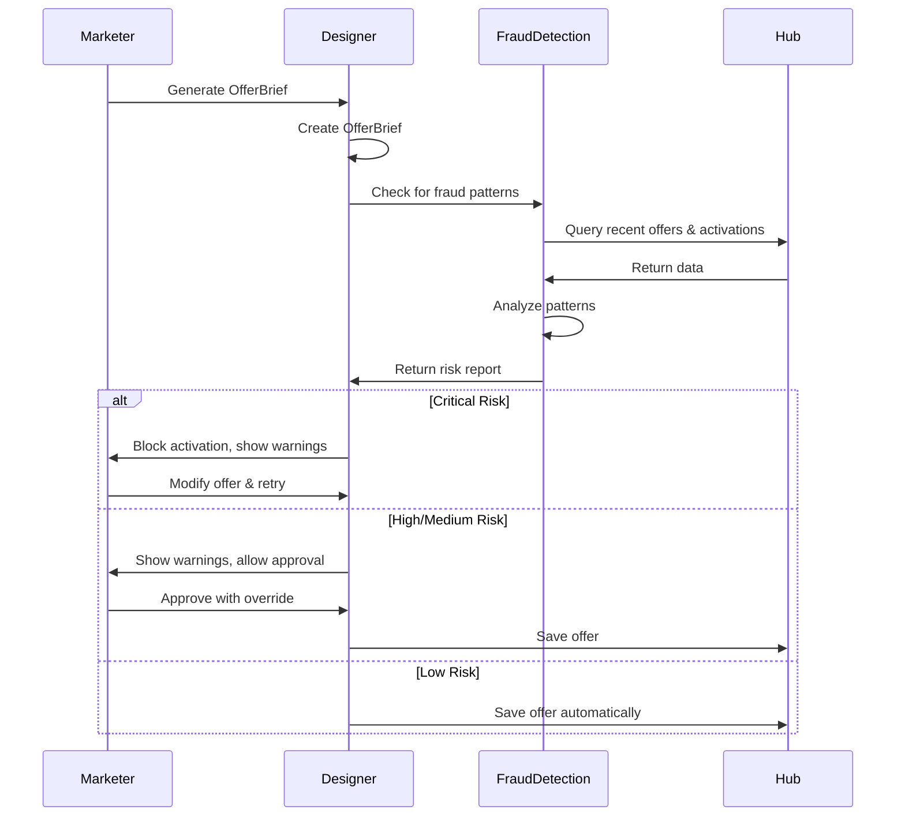

# Loyalty Fraud Detection Skill

Analyze OfferBrief for fraud patterns before approval. Blocks activation if critical risks detected.

---

## Trigger Phrases

Auto-invokes when detecting:
- "check for fraud"
- "validate offer"
- "risk analysis"
- "fraud check"
- "detect fraud patterns"
- When Designer generates OfferBrief with risk_flags populated

---

## Execution Steps

### Step 1: Read OfferBrief
Read the OfferBrief JSON from the specified path or from Hub API.

**Expected location:**
- `src/backend/api/designer/output/<offer_id>.json`
- OR via API: `GET /api/hub/offers/<offer_id>`

### Step 2: Check Fraud Patterns

#### Pattern 1: Over-Discounting
**Definition:** Discount value exceeds 30% of retail price without executive approval.

**Check logic:**
```python
if offer_brief.construct.type == "percentage_discount":
    if offer_brief.construct.value > 30:
        flag_severity = "critical" if offer_brief.construct.value > 50 else "high"
        warnings.append({
            "pattern": "over_discounting",
            "severity": flag_severity,
            "details": f"Discount {offer_brief.construct.value}% exceeds threshold (30%)",
            "recommendation": "Require executive approval or reduce discount"
        })
```

**Thresholds:**
- **<30%:** Safe
- **30-50%:** High risk (flag for review)
- **>50%:** Critical risk (block activation)

#### Pattern 2: Offer Stacking
**Definition:** Multiple high-value offers (>20% value) targeted to same member within 7 days.

**Check logic:**
1. Query Hub for recent offers to same segment
2. Filter offers created within past 7 days
3. Count high-value offers (discount >20% OR points multiplier >3x)
4. If count >= 2, flag as offer stacking

```python
recent_offers = await hub.get_offers(
    segment=offer_brief.segment.name,
    created_after=datetime.now() - timedelta(days=7)
)

high_value_count = sum(1 for o in recent_offers if is_high_value(o))

if high_value_count >= 2:
    warnings.append({
        "pattern": "offer_stacking",
        "severity": "medium",
        "details": f"{high_value_count} high-value offers in past 7 days for segment {segment_name}",
        "recommendation": "Consolidate offers or schedule sequentially"
    })
```

#### Pattern 3: Frequency Abuse
**Definition:** Targeting same member with >1 offer per 24 hours.

**Check logic:**
1. Query Hub audit log for member_id activation events
2. Count activations in past 24 hours
3. If count >= 1, reject new activation

```python
activations_24h = await hub.get_activations(
    member_id=member_id,
    since=datetime.now() - timedelta(hours=24)
)

if len(activations_24h) >= 1:
    warnings.append({
        "pattern": "frequency_abuse",
        "severity": "high",
        "details": f"Member {member_id} already received {len(activations_24h)} offer(s) in past 24h",
        "recommendation": "Queue offer for delivery after 24h window"
    })
```

**Rate limits:**
- **1 offer per 24h per member:** Hard limit
- **3 offers per week per member:** Soft limit (warn but don't block)

#### Pattern 4: Cannibalization
**Definition:** Offer overlaps with existing active promotion.

**Check logic:**
1. Query Hub for active offers with overlapping:
   - Category (e.g., Outdoor, Automotive)
   - Brands (Canadian Tire, Sport Chek)
   - Time period
2. If overlap detected, flag for marketer review

```python
active_offers = await hub.get_offers(status="active")

overlapping = [
    o for o in active_offers
    if has_overlap(o.segment.criteria, offer_brief.segment.criteria)
    and has_time_overlap(o.construct.valid_from, o.construct.valid_until, offer_brief.construct)
]

if overlapping:
    warnings.append({
        "pattern": "cannibalization",
        "severity": "medium",
        "details": f"Overlaps with {len(overlapping)} active offer(s): {[o.offer_id for o in overlapping]}",
        "recommendation": "Review for unintended cumulative discounts or budget overrun"
    })
```

### Step 3: Calculate Overall Risk Score

```python
severity_weights = {
    "critical": 100,
    "high": 50,
    "medium": 25,
    "low": 10,
}

total_score = sum(severity_weights[w["severity"]] for w in warnings)

if total_score >= 100:
    overall_severity = "critical"
elif total_score >= 50:
    overall_severity = "high"
elif total_score >= 25:
    overall_severity = "medium"
else:
    overall_severity = "low"
```

### Step 4: Output Fraud Risk Report

**Output format:** `fraud-risk-report.json`

```json
{
  "offer_id": "offer-12345",
  "timestamp": "2026-03-26T14:30:00Z",
  "overall_severity": "high",
  "total_risk_score": 75,
  "patterns_detected": [
    {
      "pattern": "over_discounting",
      "severity": "high",
      "details": "Discount 45% exceeds threshold (30%)",
      "recommendation": "Require executive approval or reduce discount"
    },
    {
      "pattern": "offer_stacking",
      "severity": "medium",
      "details": "2 high-value offers in past 7 days for segment lapsed_high_value",
      "recommendation": "Consolidate offers or schedule sequentially"
    }
  ],
  "action": "block_activation",
  "approved_by": null
}
```

### Step 5: Block or Allow Activation

**Decision logic:**
- **Critical severity:** Block activation immediately, alert marketer
- **High severity:** Require executive approval before activation
- **Medium severity:** Flag for marketer review, allow activation with warning
- **Low severity:** Log for audit trail, allow activation

---

## Configuration

| Parameter | Default | Description |
|-----------|---------|-------------|
| `max_discount_pct` | 30 | Maximum discount without approval |
| `critical_discount_pct` | 50 | Discount level that blocks activation |
| `offer_stack_window_days` | 7 | Time window to detect offer stacking |
| `frequency_cap_hours` | 24 | Minimum time between offers to same member |
| `severity_threshold` | "high" | Minimum severity to block (low/medium/high/critical) |

**Override via environment variables:**
```bash
FRAUD_MAX_DISCOUNT=35
FRAUD_CRITICAL_DISCOUNT=60
FRAUD_STACK_WINDOW=10
```

---

## Fraud Pattern Examples

### Example 1: Over-Discounting (Critical)
```json
{
  "offer_id": "offer-001",
  "construct": {
    "type": "percentage_discount",
    "value": 55,
    "description": "55% off Outdoor gear"
  }
}
```
**Result:** Critical—block activation

### Example 2: Offer Stacking (Medium)
```json
{
  "offer_id": "offer-002",
  "segment": {"name": "lapsed_high_value"},
  "created_at": "2026-03-26T10:00:00Z"
}
```
**Recent offers to same segment:**
- offer-001: 35% discount, created 2026-03-25
- offer-003: 5x points, created 2026-03-24

**Result:** Medium—flag for review

### Example 3: Frequency Abuse (High)
```json
{
  "member_id": "member-12345",
  "last_activation": "2026-03-26T08:00:00Z"
}
```
**Current time:** 2026-03-26T14:00:00Z (6 hours later)

**Result:** High—queue for later (18 hours remaining)

### Example 4: Cannibalization (Medium)
```json
{
  "offer_id": "offer-004",
  "segment": {"criteria": ["outdoor", "sport_chek"]},
  "construct": {"valid_from": "2026-03-26", "valid_until": "2026-04-02"}
}
```
**Active offers:**
- offer-005: Outdoor category, 20% off, valid 2026-03-25 to 2026-04-01

**Result:** Medium—overlaps with existing Outdoor offer

---

## Integration with Designer Workflow



---

## Output Files

All fraud detection reports saved to `fraud-reports/`:
- `fraud-reports/<offer_id>_<timestamp>.json` - Full risk report
- `fraud-reports/summary.json` - Aggregate stats (patterns detected by type, average severity)

---

## Monitoring & Alerts

### Metrics to Track
- **Fraud detection rate:** % of offers flagged
- **Blocked offers:** Count of critical-severity offers
- **False positives:** Offers flagged but manually approved
- **Pattern frequency:** Which patterns trigger most often

### Alerts
- **Critical severity:** Immediate Slack/email alert to fraud team
- **>10 high-severity in 1 hour:** Alert for potential attack
- **Manual override rate >20%:** Review fraud rules for tuning

---

## Testing

### Unit Tests
```bash
# Test over-discounting detection
pytest tests/skills/test_fraud_detection.py::test_over_discounting

# Test offer stacking
pytest tests/skills/test_fraud_detection.py::test_offer_stacking
```

### Integration Tests
```bash
# Test full workflow: OfferBrief → Fraud check → Hub save
pytest tests/integration/test_designer_fraud_workflow.py
```

---

## Best Practices

1. **Run fraud check BEFORE saving to Hub** (prevent bad offers from entering system)
2. **Log all decisions** (audit trail for compliance)
3. **Allow manual overrides** (but require approval + reason)
4. **Tune thresholds regularly** (based on false positive rate)
5. **Educate marketers** (explain why offers were flagged)

---

**Last Updated:** 2026-03-26
**Version:** 1.0
**Owner:** TriStar Hackathon Team