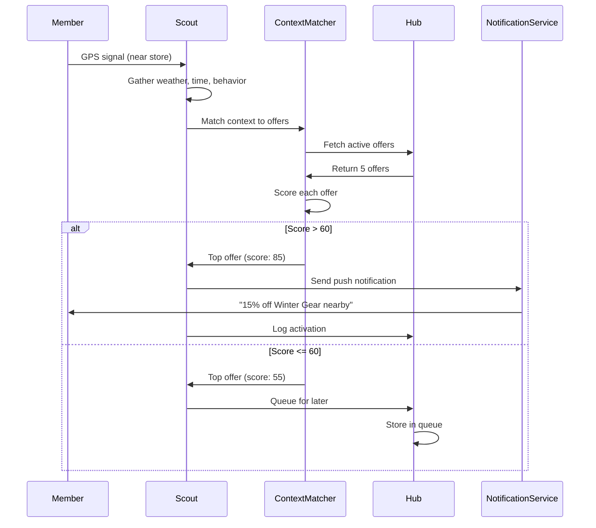

# Semantic Context Matching Skill

Match real-time context signals to approved offers in The Hub. Determines optimal activation moment based on location, time, weather, and behavioral alignment.

---

## Trigger Phrases

Auto-invokes when detecting:
- "match context to offer"
- "context matching"
- "semantic match"
- "score offers"
- "find relevant offer"
- When Scout receives context update signal

---

## Execution Steps

### Step 1: Receive Context Signal

**Input format:**
```json
{
  "member_id": "member-12345",
  "timestamp": "2026-03-26T14:30:00Z",
  "location": {
    "lat": 43.6532,
    "lon": -79.3832,
    "accuracy_meters": 50
  },
  "time": {
    "hour": 14,
    "day_of_week": "wednesday",
    "is_weekend": false
  },
  "weather": {
    "temperature_celsius": -5,
    "conditions": "cold",
    "weather_code": "clear_sky"
  },
  "behavior": {
    "last_purchase_date": "2026-02-15",
    "last_purchase_category": "outdoor",
    "days_since_visit": 39,
    "recent_categories": ["outdoor", "automotive"],
    "visit_frequency_per_month": 2.5
  }
}
```

### Step 2: Fetch Approved Offers from Hub

Query Hub API for offers with `status: "active"` and eligible for this member's segment.

```python
active_offers = await hub.get_offers(
    status="active",
    segment=member.segment,
    valid_for_member=member_id
)
```

**Filter criteria:**
- Status must be "active"
- Offer not yet delivered to this member (check audit log)
- Offer within frequency cap (respects 24h rule)
- Segment criteria match member profile

### Step 3: Score Each Offer

**Scoring algorithm:** 4 dimensions, total 100 points

#### Dimension 1: Location Match (40 points max)

**Calculate distance** between member's GPS coordinates and nearest relevant store:

```python
def calculate_distance(lat1, lon1, lat2, lon2) -> float:
    # Haversine formula
    R = 6371  # Earth radius in km
    dlat = radians(lat2 - lat1)
    dlon = radians(lon2 - lon1)
    a = sin(dlat/2)**2 + cos(radians(lat1)) * cos(radians(lat2)) * sin(dlon/2)**2
    c = 2 * atan2(sqrt(a), sqrt(1-a))
    return R * c
```

**Scoring:**
```python
if distance_km < 0.5:
    location_score = 40  # Within 500m (walking distance)
elif distance_km < 1.0:
    location_score = 30  # Within 1km (short drive)
elif distance_km < 2.0:
    location_score = 20  # Within 2km (nearby)
else:
    location_score = 0   # Too far
```

**Store lookup:**
- Canadian Tire: lat/lon from mock data
- Tim Hortons: lat/lon from mock data
- Sport Chek: lat/lon from mock data

**If offer targets multiple brands:** Use closest store.

#### Dimension 2: Time Match (30 points max)

**Check if current time matches offer's preferred delivery hours/days:**

```python
preferred_hours = offer.delivery_rules.get("preferred_hours", [])  # e.g., [9, 10, 11, 14, 15, 16]
preferred_days = offer.delivery_rules.get("preferred_days", [])    # e.g., ["monday", "wednesday", "friday"]

current_hour = context.time.hour
current_day = context.time.day_of_week

if current_hour in preferred_hours:
    time_score = 30  # Exact hour match
elif current_day in preferred_days:
    time_score = 20  # Day match (but not ideal hour)
else:
    time_score = 0   # No match
```

**Default preferred hours** (if not specified):
- Morning: 8-11 (breakfast/commute)
- Afternoon: 14-17 (after lunch)
- Evening: 18-20 (after work)

**Avoid quiet hours:** 10pm-8am (score = 0)

#### Dimension 3: Weather Match (20 points max)

**Match weather-dependent offers:**

```python
weather_trigger = offer.delivery_rules.get("weather_trigger")  # e.g., "cold", "rainy", "hot"
current_weather = context.weather.conditions

if weather_trigger:
    if current_weather == weather_trigger:
        weather_score = 20  # Exact match (e.g., cold weather → winter gear offer)
    else:
        weather_score = 0   # No match
else:
    weather_score = 10  # Weather-agnostic offer (baseline score)
```

**Weather conditions:**
- **Cold:** Temperature < 0°C → Offers for winter gear, hot beverages
- **Hot:** Temperature > 25°C → Offers for outdoor activities, cooling products
- **Rainy:** Precipitation > 0mm → Offers for indoor activities, car care
- **Sunny:** Clear sky → Offers for outdoor recreation

#### Dimension 4: Behavior Match (10 points max)

**Match offer category to member's recent purchase history:**

```python
offer_category = offer.segment.criteria[0]  # e.g., "outdoor"
recent_categories = context.behavior.recent_categories  # e.g., ["outdoor", "automotive"]

if offer_category in recent_categories:
    behavior_score = 10  # Member has shown interest in this category
else:
    behavior_score = 0   # New category (cold start)
```

**Additional behavioral signals** (bonus points):
- Member is lapsed (>30 days since visit): +5 bonus to reactivation offers
- Member is high-value (>5000 points): +5 bonus to premium offers

### Step 4: Calculate Total Score

```python
total_score = location_score + time_score + weather_score + behavior_score

# Apply modifiers
if member.is_lapsed and offer.objective.includes("reactivate"):
    total_score += 5

if member.is_high_value and offer.construct.value > 20:
    total_score += 5

# Cap at 100
total_score = min(total_score, 100)
```

### Step 5: Rank Offers by Score

```python
scored_offers = [
    {"offer_id": offer.offer_id, "score": total_score, "breakdown": {...}}
    for offer in active_offers
]

scored_offers.sort(key=lambda x: x["score"], reverse=True)
```

### Step 6: Activation Decision

**Threshold:** Activate if `score > 60`

```python
best_offer = scored_offers[0]

if best_offer["score"] > 60:
    action = "activate"
    notification = create_notification(member_id, best_offer["offer_id"], context)
    await send_notification(notification)
    await hub.log_activation(member_id, best_offer["offer_id"], best_offer["score"])
else:
    action = "queue_for_later"
    await hub.queue_offer(member_id, best_offer["offer_id"], reason="score_below_threshold")
```

### Step 7: Output Matching Report

**Output format:** `context-match-report.json`

```json
{
  "member_id": "member-12345",
  "timestamp": "2026-03-26T14:30:00Z",
  "context_summary": {
    "location": "43.6532,-79.3832 (near Sport Chek Yonge & Dundas)",
    "time": "Wednesday 2:30pm",
    "weather": "Cold (-5°C), clear sky",
    "behavior": "Lapsed 39 days, last purchased Outdoor"
  },
  "offers_scored": 5,
  "top_offer": {
    "offer_id": "offer-12345",
    "objective": "Reactivate lapsed outdoor enthusiasts",
    "total_score": 85,
    "score_breakdown": {
      "location": 40,
      "time": 30,
      "weather": 20,
      "behavior": 10,
      "modifiers": 5
    },
    "activation_reason": "High proximity + cold weather + lapsed member reactivation"
  },
  "action": "activate",
  "notification_sent": true
}
```

---

## Configuration

| Parameter | Default | Description |
|-----------|---------|-------------|
| `activation_threshold` | 60 | Minimum score to activate (0-100) |
| `max_distance_km` | 2.0 | Maximum distance for location match |
| `quiet_hours_start` | 22 | No notifications after this hour (24h format) |
| `quiet_hours_end` | 8 | No notifications before this hour |
| `lookback_days` | 30 | Behavior history window |
| `enable_weather_matching` | true | Enable weather-based scoring |

**Override via environment variables:**
```bash
CONTEXT_ACTIVATION_THRESHOLD=70
CONTEXT_MAX_DISTANCE_KM=1.5
CONTEXT_QUIET_HOURS_START=23
```

---

## Scoring Examples

### Example 1: High Score (85/100) - Activate

**Context:**
- Location: 500m from Sport Chek
- Time: Wednesday 2:30pm
- Weather: Cold (-5°C)
- Behavior: Lapsed 39 days, last bought Outdoor

**Offer:**
- Objective: "Reactivate lapsed outdoor enthusiasts"
- Category: Outdoor
- Delivery: Preferred afternoons, cold weather trigger
- Store: Sport Chek

**Score Breakdown:**
- Location: 40 (within 500m)
- Time: 30 (Wednesday afternoon = preferred)
- Weather: 20 (cold weather match)
- Behavior: 10 (outdoor category match)
- Modifier: +5 (lapsed member reactivation)

**Total: 85/100** → **Activate** ✅

**Notification:**
> **15% off Winter Outdoor Gear at Sport Chek**
> You're just 5 minutes away! Redeem in-store today. Valid for 2 hours.

---

### Example 2: Medium Score (55/100) - Queue

**Context:**
- Location: 1.8km from Canadian Tire
- Time: Saturday 7:00pm
- Weather: Sunny, warm
- Behavior: Active shopper, last visited 5 days ago

**Offer:**
- Objective: "Promote Automotive products"
- Category: Automotive
- Delivery: No time preference, any weather
- Store: Canadian Tire

**Score Breakdown:**
- Location: 20 (within 2km, but not close)
- Time: 20 (Saturday evening = somewhat preferred)
- Weather: 10 (weather-agnostic)
- Behavior: 0 (no recent Automotive purchases)
- Modifier: 0

**Total: 50/100** → **Queue for later** ⏸️

**Reason:** Score below threshold (60), member not close enough

---

### Example 3: Low Score (10/100) - Discard

**Context:**
- Location: 5km from Tim Hortons
- Time: Monday 11:00pm
- Weather: Rainy
- Behavior: New member, no purchase history

**Offer:**
- Objective: "Breakfast combo promotion"
- Category: Food & Beverage
- Delivery: Morning hours (7-10am)
- Store: Tim Hortons

**Score Breakdown:**
- Location: 0 (too far)
- Time: 0 (quiet hours, wrong time of day)
- Weather: 10 (baseline)
- Behavior: 0 (no history)
- Modifier: 0

**Total: 10/100** → **Discard** ❌

**Reason:** Multiple mismatches (distance, time, behavior)

---

## Integration with Scout Workflow



---

## Output Files

All context matching reports saved to `context-match-reports/`:
- `context-match-reports/<member_id>_<timestamp>.json` - Full match report
- `context-match-reports/daily_summary.json` - Aggregate stats (activations, avg score, top patterns)

---

## Monitoring & Alerts

### Metrics to Track
- **Activation rate:** % of context signals that result in activation
- **Average score:** Mean score of top-ranked offers
- **Score distribution:** Histogram of scores (0-20, 21-40, 41-60, 61-80, 81-100)
- **Dimension contribution:** Which dimensions contribute most to score (location vs time vs weather vs behavior)

### Alerts
- **Activation rate <5%:** Threshold may be too high (tune from 60 to 50)
- **Average score <40:** Offers not matching context well (review offer design)
- **No activations for 1 hour:** Check if Scout is receiving context signals

---

## Testing

### Unit Tests
```bash
# Test location scoring
pytest tests/skills/test_context_matching.py::test_location_score

# Test time scoring
pytest tests/skills/test_context_matching.py::test_time_score

# Test weather matching
pytest tests/skills/test_context_matching.py::test_weather_match
```

### Integration Tests
```bash
# Test full workflow: Context signal → Match → Activate
pytest tests/integration/test_scout_activation_workflow.py
```

---

## Best Practices

1. **Log all scoring decisions** (audit trail + ML training data)
2. **A/B test threshold values** (60 vs 50 vs 70)
3. **Personalize over time** (learn member preferences)
4. **Respect quiet hours** (no notifications 10pm-8am)
5. **Monitor false positives** (activations that don't convert)

---

**Last Updated:** 2026-03-26
**Version:** 1.0
**Owner:** TriStar Hackathon Team