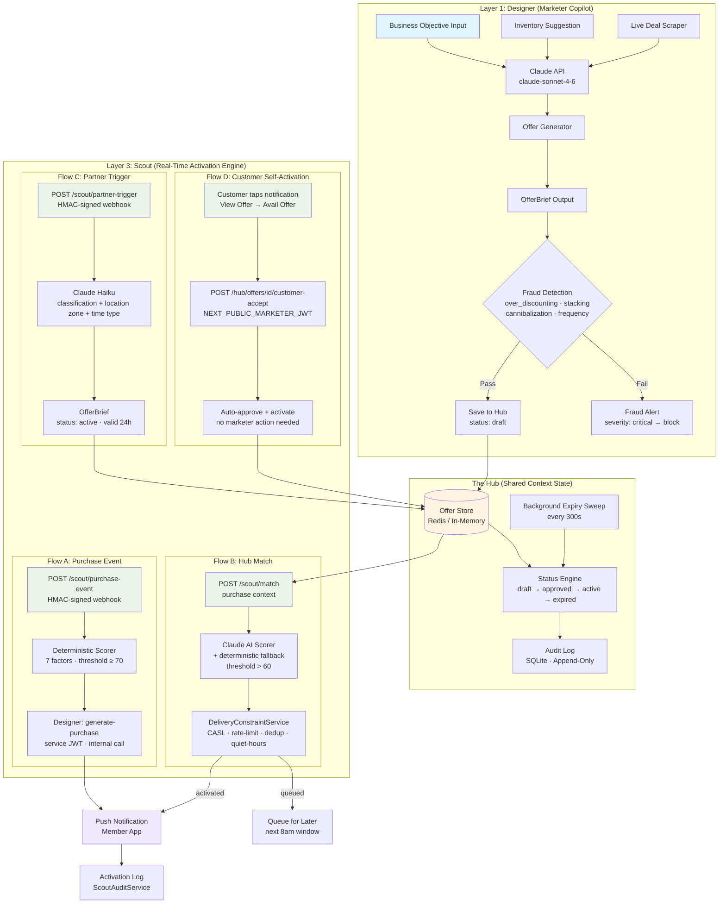
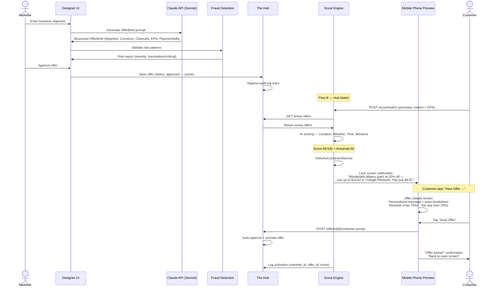
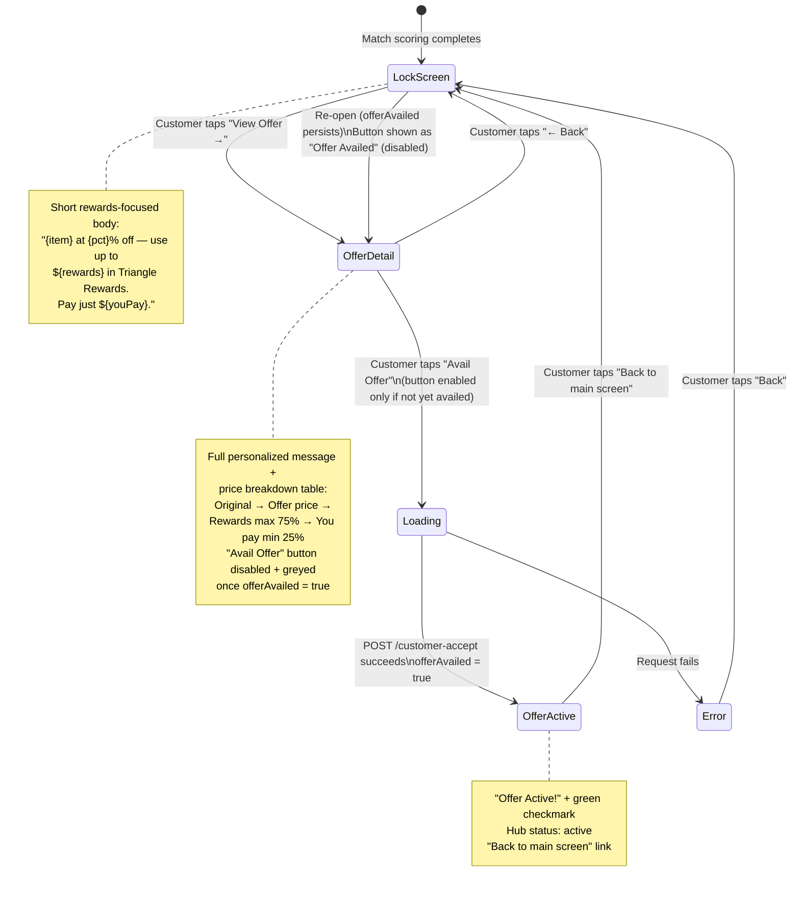
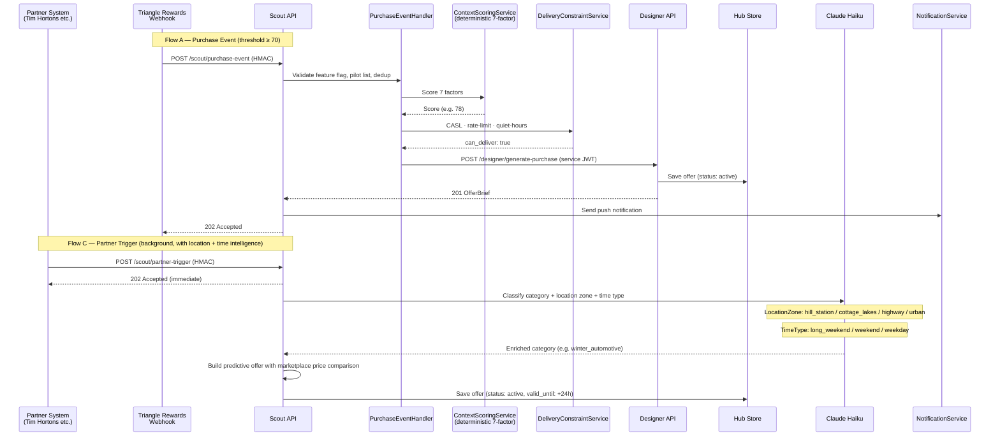
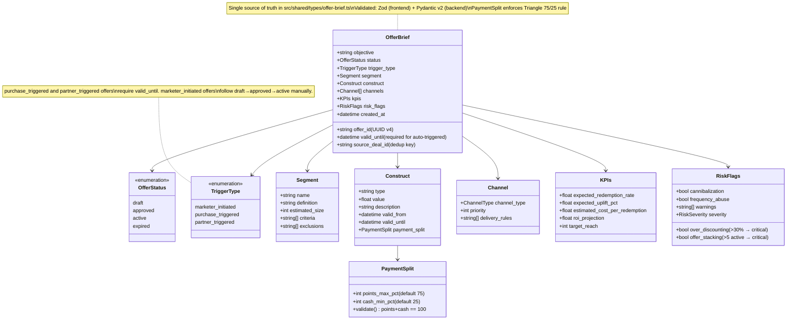
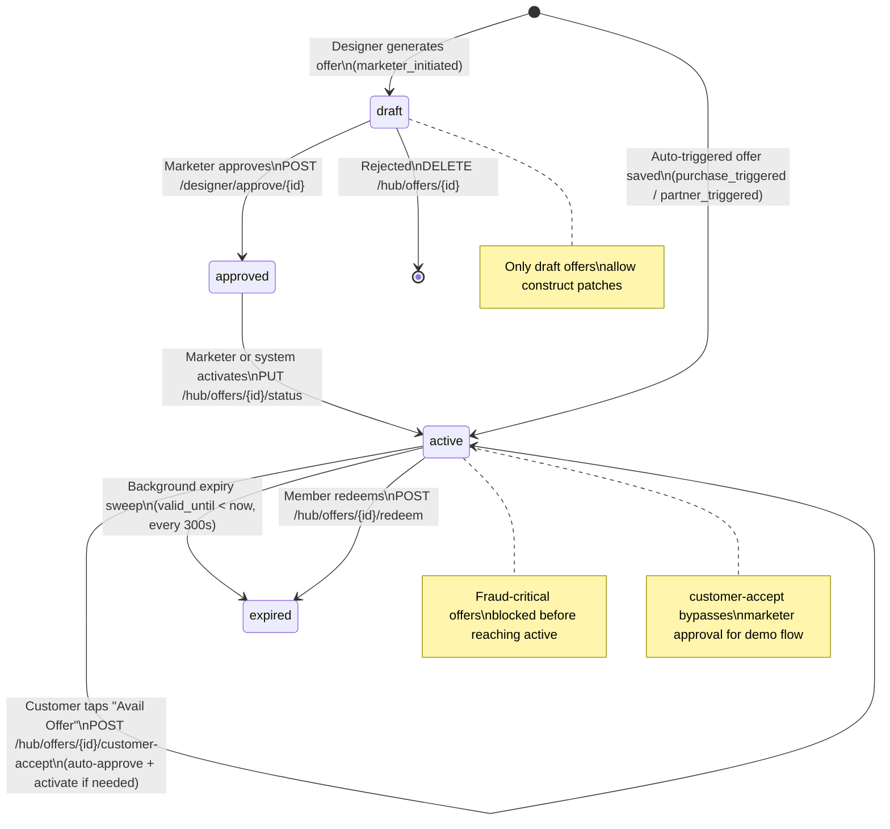
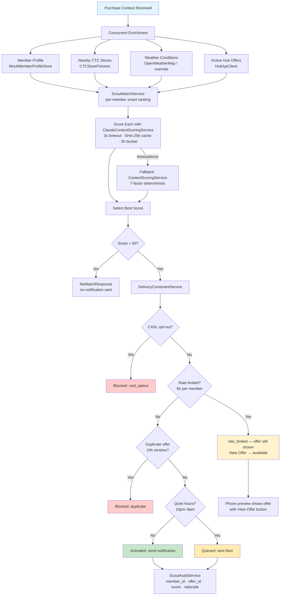
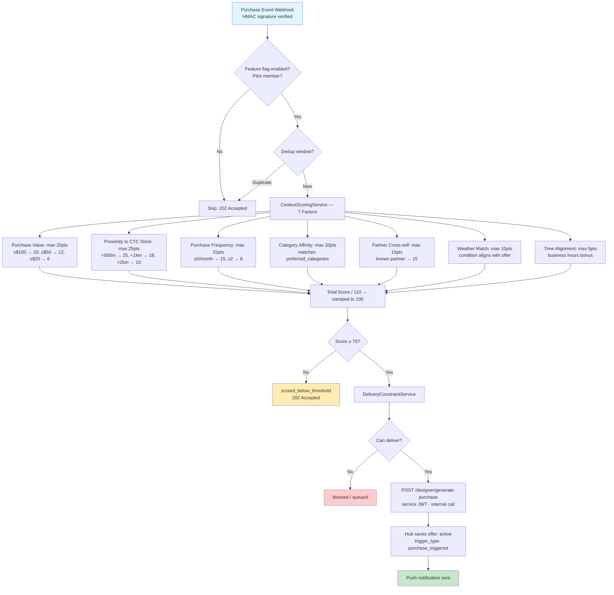
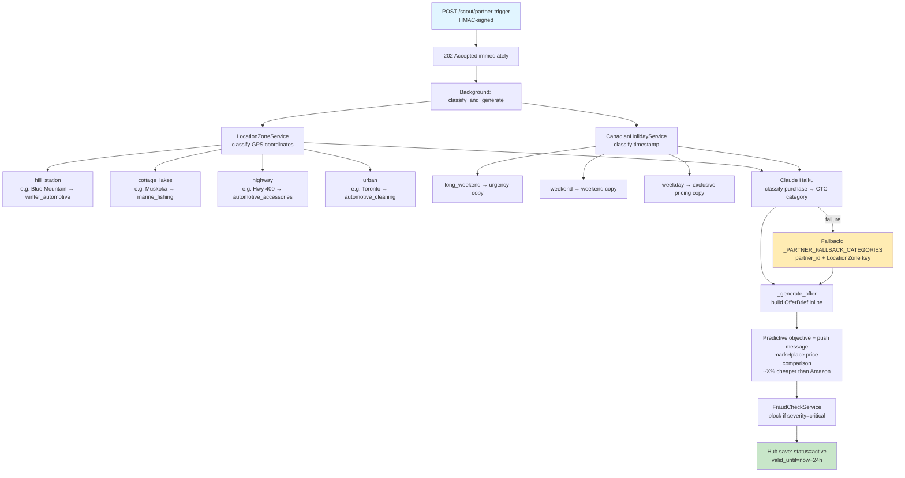

# TriStar Architecture

**Project:** Triangle Smart Targeting and Real-Time Activation
**Hackathon:** CTC True North 2026 (March 9-18)
**Last Updated:** 2026-04-05 (v3.1)

---

## Executive Summary

TriStar transforms the Triangle loyalty program from a reactive points ledger into a proactive, AI-powered engagement platform. The system combines intelligent offer design (Designer) with real-time contextual activation (Scout), connected through a shared state (Hub), and delivers a realistic iPhone-style push notification demo that takes a customer from notification → offer details → avail offer in one seamless flow.

**Three Core Layers:**
1. **Designer (Marketer Copilot)** — AI-powered offer design generating OfferBriefs from business objectives or inventory signals
2. **The Hub (Shared Context State)** — Central repository managing offer lifecycle with append-only audit log
3. **Scout (Real-Time Activation Engine)** — Context-aware delivery with four flows: purchase events, hub matching, partner triggers, and customer self-activation

---

## System Overview



---

## End-to-End Flow



---

## Customer Phone Preview — 3-Screen Flow

The Scout page includes a realistic iPhone lock-screen mockup. After Run Match Scoring or Trigger Partner Cross-Sell, the phone simulates exactly what the customer sees.



### Screen Content

| Screen | Title | Body |
|--------|-------|------|
| **Lock screen notification** | e.g. `Exclusive offer for you, Alice!` | Short: `Windshield Wipers (pair) at 22% off — use up to $14.62 in Triangle Rewards. Pay just $4.87.` |
| **Offer Details** | `Offer Details` | Personalized: *"Spring is here, Alice! Since you picked up a Motor Oil 5W-30 (5L), your next best offer is Windshield Wipers (pair) at 22% off."* + full price breakdown |
| **Offer Active** | `Offer Active!` | Confirmation with Hub link + "Back to main screen" |

### Avail Offer Button States

| State | Button Label | Style | Clickable |
|-------|-------------|-------|-----------|
| Not yet availed | `Avail Offer` | Red (`#E4003A`) | Yes |
| Availed (`offerAvailed = true`) | `Offer Availed` | Grey, 60% opacity | No (disabled) |

`offerAvailed` is a React state flag set to `true` on successful `POST /customer-accept`. It **persists** while the current context result is active — even if the customer navigates back to the lock screen and reopens the offer. It resets to `false` only when a new context match result arrives (fresh trigger).

---

## Scout Activation Flows



---

## Component Architecture

```mermaid
graph LR
    subgraph Frontend["Frontend (Next.js 15 · App Router)"]
        A[React 19<br/>TypeScript · Tailwind CSS]
        A --> B[Dashboard /]
        A --> C[Designer /designer<br/>AI Suggestions · Manual Entry]
        A --> D[Hub /hub<br/>Live Polling 5s]
        A --> E[Scout /scout<br/>Purchase Simulator]
        A --> F[Next.js API Route<br/>/api/hub-offers proxy]
    end

    subgraph Backend["Backend (FastAPI · Python 3.11)"]
        G[FastAPI App<br/>main.py]
        G --> H[/api/designer<br/>generate · approve · suggestions · live-deals]
        G --> I[/api/hub<br/>CRUD · status · redeem · customer-accept]
        G --> J[/api/scout<br/>match · purchase-event · partner-trigger]
        G --> K[/api/auth/demo-token<br/>/health]
    end

    subgraph Services["Backend Services"]
        L[ClaudeApiService<br/>Sonnet · 3-retry · 5min cache]
        M[ClaudeContextScoringService<br/>Haiku · 3s timeout · fallback]
        N[ContextScoringService<br/>Deterministic 7-factor]
        O[FraudCheckService]
        P[HubStore<br/>InMemory / Redis]
        Q[HubAuditService<br/>SQLite append-only]
        R[DeliveryConstraintService<br/>CASL · rate-limit · dedup]
        S[PartnerTriggerService<br/>Haiku + LocationZone + TimeType]
        T[InventoryService<br/>CSV overstock · project-root path]
        U[DealScraperService<br/>CTC website · 15min cache]
        V[ScoutAuditService<br/>activation records]
        W2[ScoutMatchService<br/>per-member smart matching]
        X2[LocationZoneService<br/>hill_station / cottage_lakes / highway / urban]
        Y2[CanadianHolidayService<br/>long_weekend / weekend / weekday]
    end

    subgraph External["External Services"]
        W[Claude API<br/>claude-sonnet-4-6<br/>claude-haiku-4-5-20251001]
        X[Weather API<br/>OpenWeatherMap]
    end

    subgraph Data["Data Layer"]
        Y[(Redis<br/>Hub State<br/>offer:{id} keys)]
        Z[(SQLite<br/>Audit Logs)]
    end

    C <-->|HTTP/JSON| H
    D <-->|HTTP/JSON| I
    E <-->|HTTP/JSON| J
    F <-->|proxy| I

    H --> L
    H --> O
    J --> M
    J --> N
    J --> R
    J --> S
    J --> W2
    H --> T
    H --> U
    I --> P
    I --> Q
    J --> V
    S --> X2
    S --> Y2

    L --> W
    M --> W
    S --> W
    J --> X

    P --> Y
    Q --> Z
    V --> Z

    style A fill:#61dafb
    style G fill:#009688
    style W fill:#e07c3e
    style Y fill:#dc382d
```

---

## Data Flow: OfferBrief Schema



---

## Hub State Machine



---

## Context Matching Algorithm

### Flow B — Hub Match (Claude AI Primary, Deterministic Fallback)



**Note on `rate_limited`:** Even when rate-limited (notification already sent recently), the phone preview still shows the offer with "View Offer →" so the customer can view details and avail it.

### Flow A — Purchase Event (Deterministic, 7-Factor)



### Flow C — Partner Trigger (Location + Time Intelligence)



---

## API Reference

### Designer (`/api/designer`)

| Method | Path | Auth | Description |
|--------|------|------|-------------|
| `POST` | `/generate` | marketing | Generate OfferBrief from objective via Claude Sonnet. Auto-saves to Hub as draft. |
| `POST` | `/generate-purchase` | system | Purchase-triggered offer generation. Saves to Hub as active. |
| `POST` | `/approve/{offer_id}` | marketing | Transition draft → approved. |
| `GET` | `/suggestions` | **public** | Top-N inventory overstock suggestions (excludes already-offered products). |
| `GET` | `/live-deals` | marketing | Scraped Canadian Tire deals (15-min cache, 20-item demo fallback). |

### Hub (`/api/hub`)

| Method | Path | Auth | Description |
|--------|------|------|-------------|
| `POST` | `/offers` | marketing/system | Save offer. Rejects active status for marketer-initiated offers. |
| `GET` | `/offers/{offer_id}` | **public** | Get offer by ID. |
| `GET` | `/offers` | **public** | List offers. Filters: status, trigger_type, since, member_id. Deduplicates by objective. |
| `PUT` | `/offers/{offer_id}/status` | marketing | Status transition. Enforces VALID_TRANSITIONS state machine. |
| `PATCH` | `/offers/{offer_id}/construct` | marketing | Update construct value (draft only). |
| `DELETE` | `/offers/{offer_id}` | marketing | Reject (delete) a draft offer. |
| `POST` | `/offers/{offer_id}/redeem` | any | Validate Triangle 75/25 payment split. |
| `POST` | `/offers/{offer_id}/customer-accept` | marketing | **New.** Customer taps "Avail Offer" — auto-approves + activates without marketer action. Used by phone preview demo. |
| `DELETE` | `/admin/reset` | — | Dev only: clear all Hub offers. |

### Scout (`/api/scout`)

| Method | Path | Auth | Description |
|--------|------|------|-------------|
| `POST` | `/purchase-event` | HMAC | Purchase event webhook (Flow A). Returns 202. |
| `POST` | `/match` | any | Score Hub offers against purchase context (Flow B). Returns `MatchResponse` or `NoMatchResponse`. |
| `GET` | `/activation-log/{member_id}` | any | Recent activation records for a member. |
| `POST` | `/partner-trigger` | HMAC | Partner purchase webhook (Flow C). Returns 202. Background classification + offer generation. |

### System

| Method | Path | Description |
|--------|------|-------------|
| `POST` | `/api/auth/demo-token` | Short-lived demo JWT for Swagger or E2E testing. `?role=marketing` for marketer token. |
| `GET` | `/health` | Health check including Redis status (`redis: ok/degraded`). |

**Auth note:** Read-only GET endpoints (`/hub/offers`, `/hub/offers/{id}`, `/designer/suggestions`) are public — no JWT required. This enables cross-machine demo without `.env.local` setup affecting read operations.

---

## Hub Store Implementation

```mermaid
graph TD
    A{HUB_REDIS_ENABLED?} -->|False: dev/test| B[InMemoryHubStore\ndict-based]
    A -->|True: prod| C[RedisHubStore\nSCAN-based]

    B --> D[save: OfferAlreadyExistsError\non dup offer_id or source_deal_id]
    C --> E[save: atomic SET NX\nrollback deal index on failure]

    C --> F[list: SCAN offer:* cursor\nmget batch fetch\n_apply_filters]
    C --> G[Secondary index\nhub:deal:{source_deal_id} → offer_id\nfor cross-offer dedup]

    H[Background Expiry Sweep\nasyncio task · every 300s] --> I[hub_store.list active offers\ncheck valid_until < now\nhub_store.update → expired]

    style B fill:#e8f5e8
    style C fill:#dc382d,color:#fff
    style H fill:#fff4e1
```

**Key behaviours:**
- Both stores reject `save()` if an offer with the same `source_deal_id` already exists in draft/approved/active — prevents the same live deal being offered twice.
- `RedisHubStore` uses `SCAN` (not `KEYS`) to avoid blocking the Redis event loop.
- Redis `maxmemory-policy` must be `noeviction`; startup validates this and logs CRITICAL if misconfigured.

---

## Delivery Constraint Enforcement

```
DeliveryConstraintService (in-memory dev) / RedisDeliveryConstraintService (prod)

For every potential notification:
  1. CASL opt-out check        → blocked: casl_optout
  2. Rate limit: 6h per member → rate_limited (offer still shown in phone preview with View Offer →)
  3. 24h dedup (same offer)    → blocked: duplicate
     ↳ bypassed if purchase_value > $100
  4. Quiet hours 10pm–8am      → queued: next 8am window

Redis keys:
  scout:rate:{member_id}  TTL 6h
  scout:dedup:{member_id}:{offer_id}  TTL 24h
  scout:morning:{member_id}  TTL until 8am next day
```

---

## Frontend Structure

```
src/frontend/
├── app/                          # Next.js 15 App Router
│   ├── layout.tsx               # Root layout — sidebar shell, Public Sans font
│   ├── page.tsx                 # Dashboard: KPI cards, recent offers, activation trend
│   ├── designer/
│   │   ├── page.tsx             # Server Component — fetches suggestions server-side
│   │   └── actions.ts           # Server Actions
│   ├── hub/
│   │   ├── page.tsx             # Server Component — initial offers + live polling
│   │   └── actions.ts           # Server Actions
│   ├── scout/
│   │   └── page.tsx             # Scout context simulator
│   └── api/hub-offers/
│       └── route.ts             # Next.js API Route — Hub proxy for client polling
├── components/
│   ├── Designer/
│   │   ├── ModeSelectorTabs.tsx  # AI Suggestions / Manual Entry tab switcher (10s Hub sync)
│   │   ├── AISuggestionsPanel.tsx
│   │   ├── ManualEntryForm.tsx
│   │   ├── OfferBriefCard.tsx
│   │   ├── RiskFlagBadge.tsx
│   │   └── ApproveButton.tsx
│   ├── Hub/
│   │   ├── LiveHubContent.tsx   # Client — polls every 5s, client-side filter
│   │   ├── OfferList.tsx
│   │   ├── OfferCard.tsx
│   │   ├── StatusBadge.tsx
│   │   └── StatusActionButtons.tsx
│   ├── Scout/
│   │   ├── ContextDashboard.tsx # Purchase simulator — 19 store fixtures, member/item/weather controls
│   │   │                        # predictNextBestItem() — per-member AI next-best-item recommendation
│   │   │                        # generatePersonalizedMessage() — seasonal + occasion-aware copy
│   │   │                        # startPartnerOfferPoll() — polls /api/hub-offers every 2s up to 30s
│   │   ├── MobileNotificationPreview.tsx  # iPhone lock-screen mockup — 3-screen flow:
│   │   │                                  #   1. Lock screen (short rewards body)
│   │   │                                  #   2. Offer Details (personalized msg + price breakdown)
│   │   │                                  #      "Avail Offer" button disabled once offerAvailed=true
│   │   │                                  #   3. Offer Active (confirmation + back to main)
│   │   └── ActivationFeed.tsx   # Score, outcome, rationale, notification text
│   └── Shell/
│       ├── SidebarNav.tsx
│       └── Breadcrumb.tsx
├── services/
│   ├── designer-api.ts
│   └── hub-api.ts
└── lib/
    ├── scout-api.ts             # callScoutMatch · callPartnerTrigger · customerAcceptOffer
    └── config.ts
```

---

## Partner Trigger Intelligence

The `PartnerTriggerService` classifies purchases using two context dimensions:

### Location Zones (`LocationZoneService`)

| Zone | Example | Default CTC Category |
|------|---------|---------------------|
| `hill_station` | Blue Mountain (lat 44.50, lon -80.31) | `winter_automotive` |
| `cottage_lakes` | Muskoka region | `marine_fishing` |
| `highway` | Hwy 400 corridor | `automotive_accessories` |
| `urban` | Toronto city centre | `automotive_cleaning` |

### Time Types (`CanadianHolidayService`)

| Type | Trigger | Push copy |
|------|---------|-----------|
| `long_weekend` | Stat holiday period | *"before the long weekend crowds hit"* |
| `weekend` | Saturday / Sunday | *"this weekend — great time to stock up"* |
| `weekday` | Mon–Fri | *"today — exclusive weekday pricing"* |

### Marketplace Price Comparison

Each category has a `_MARKETPLACE_PREMIUM` multiplier (e.g. `ski_accessories: 1.22` = ~22% cheaper than Amazon). This is embedded in the push message to drive urgency.

### Supported Partners

| Partner | Zones | Haiku prompt |
|---------|-------|-------------|
| `tim_hortons` | all 4 | coffee at resort → winter_automotive, drive-through → automotive_cleaning |
| `westjet` | all 4 | domestic → luggage, family → outdoor_camping |
| `sport_chek` | all 4 | hill/lakes → outdoor_camping, urban → fitness |

---

## Cross-Machine Setup

Since `.env` and `src/frontend/.env.local` are gitignored, each developer must set them up once:

```
1. cp .env.example .env
   → fill in CLAUDE_API_KEY, confirm JWT_SECRET=dev-secret-change-in-prod

2. uvicorn src.backend.main:app --reload --port 8000

3. curl -s -X POST "http://localhost:8000/api/auth/demo-token?role=marketing"
   → copy access_token

4. cp src/frontend/.env.local.example src/frontend/.env.local
   → replace REPLACE_WITH_YOUR_TOKEN with the token

5. cd src/frontend && npm run dev
```

**Token lifetime:** 100 hours (`SERVICE_JWT_EXPIRY_HOURS=100`). Regenerate if you get 401 errors on write operations.

**Public endpoints (no token needed):** `GET /api/hub/offers`, `GET /api/hub/offers/{id}`, `GET /api/designer/suggestions` — Hub and Designer read views work without a token.

---

## Technology Stack

### Frontend
- **Framework:** Next.js 15 (App Router, Server Components)
- **Language:** TypeScript 5.x (strict mode)
- **Styling:** Tailwind CSS
- **State Management:** React Context + `useOptimistic`
- **Data Fetching:** React.use() with Suspense; polling via `setInterval`
- **Forms:** React Server Actions
- **Validation:** Zod (mirrors Python Pydantic models)
- **Testing:** Jest + React Testing Library, Playwright (E2E)

### Backend
- **Framework:** FastAPI 0.115+
- **Language:** Python 3.11+
- **Validation:** Pydantic v2
- **Async Runtime:** asyncio + uvicorn
- **Database:** SQLite via aiosqlite (dev audit log)
- **Cache/Store:** Redis 7.x (prod Hub store + delivery constraints)
- **HTTP Client:** httpx (async, internal service calls)
- **Auth:** PyJWT (HS256), HMAC webhook verification
- **Testing:** Pytest + httpx AsyncClient
- **Logging:** loguru (structured JSON)

### AI Services
| Model | Used For |
|-------|----------|
| `claude-sonnet-4-6` | OfferBrief generation from marketer objectives and purchase context |
| `claude-haiku-4-5-20251001` | Context scoring (3s timeout, fallback); partner purchase classification with location + time context |

### Infrastructure
- **Cloud:** Microsoft Azure
- **Compute:** App Service (frontend), Azure Functions (backend)
- **Data:** Azure Redis Cache, Azure SQL Database
- **Monitoring:** Application Insights
- **Secrets:** Azure Key Vault
- **CI/CD:** GitHub Actions

---

## Security Architecture

### Authentication & Authorization

| Role | Token Source | Access |
|------|-------------|--------|
| `marketing` | Demo JWT via `/api/auth/demo-token?role=marketing` | Designer generate/approve, Hub writes, customer-accept |
| `system` | Service JWT via `ScoutServiceAuth` | Scout → Designer internal calls |
| Webhook callers | HMAC-SHA256 signature header | `/scout/purchase-event`, `/scout/partner-trigger` |
| Public | No token | GET `/hub/offers`, GET `/designer/suggestions` |

### Data Flow Security
- **In Transit:** TLS 1.3 for all HTTP traffic
- **At Rest:** Azure Storage encryption (256-bit AES)
- **Secrets:** Azure Key Vault with managed identities
- **PII Handling:** Log `member_id` only — no names, emails, addresses, or GPS coordinates in logs
- **Rate Limiting:** 100 requests/min per IP (API Management layer)
- **Webhooks:** HMAC-SHA256 — bypassed only in `ENVIRONMENT=development`
- **Prompt injection:** Partner purchase fields capped at 100 chars before Haiku classification

---

## Performance Metrics

| Metric | Target | Measurement Method |
|--------|--------|-------------------|
| API Response Time (p95) | <200ms | loguru WARNING if exceeded (`hub_latency_exceeded`) |
| Frontend Page Load | <2s (FCP) | Lighthouse CI |
| Claude Scoring Latency | <3s (timeout + fallback) | Custom timer |
| Partner Trigger Background SLA | <2s | Background task measurement |
| Cache Hit Rate (Hub) | >80% | Redis INFO stats |
| Offer Generation Time | <5s | Claude API latency |
| Expiry Sweep Interval | 300s | Background task config |
| Partner offer poll (frontend) | 2s interval · 30s max | `setInterval` in ContextDashboard |

---

## Scalability Considerations

### Current Scale (Hackathon Demo)
- **Users:** ~100 concurrent demo users
- **Offers:** ~1,000 active offers in Hub
- **Context Signals:** ~10 signals/sec
- **Notifications:** ~5 notifications/sec

### Production Scale (Future)
- **Users:** 10M+ Triangle members
- **Offers:** 100K+ active offers
- **Context Signals:** 10K signals/sec
- **Notifications:** 1K notifications/sec

### Scaling Strategy
1. **Horizontal Scaling:** Azure Functions auto-scale based on queue depth
2. **Caching:** Redis cluster with read replicas; `ClaudeContextScoringService` uses in-process LRU cache (max 200 entries, 3-hour bucket key)
3. **Database:** Sharding by `member_id` (10M members = 10 shards)
4. **CDN:** Azure CDN for static assets
5. **Async Processing:** Purchase events queued via HMAC webhook, processed in background

---

## Monitoring & Observability

### Metrics to Track
1. **Business Metrics:**
   - Offer generation rate (offers/hour, by trigger_type)
   - Activation rate (notifications/hour)
   - Redemption rate (redeemed/activated)
   - Score distribution (activated vs queued vs blocked)
   - Customer self-activation rate (customer-accept calls)

2. **Technical Metrics:**
   - API latency (p50, p95, p99) — WARNING logged if >200ms
   - Error rate (5xx responses)
   - Claude scoring cache hit rate
   - Redis Hub store SCAN latency
   - Partner trigger background task success rate

3. **User Experience:**
   - Frontend page load time
   - Hub live-poll latency (target <5s)
   - Notification delivery success rate
   - Phone preview offer-to-avail conversion

---

## Future Enhancements

### Phase 2 (Post-Hackathon)
- **ML Scoring:** Replace deterministic 7-factor scorer with trained model on activation history
- **A/B Testing:** Experimentation framework for offer variants
- **Multi-Language:** French language support for Quebec members
- **Partner Integration:** WestJet, Sport Chek real-time inventory sync
- **Real Push Notifications:** Replace phone preview mockup with FCM/APNs integration

### Phase 3 (Production)
- **Mobile Apps:** Native iOS/Android with offline support
- **Redis Streams:** Replace polling with push-based Hub event streaming to frontend
- **AI Agents:** Multi-agent orchestration for complex multi-touchpoint campaigns
- **Compliance:** Immutable audit trail for CTC regulatory requirements

---

**Document Version:** 3.0
**Generated:** 2026-04-05
**Maintainers:** TriStar Hackathon Team
