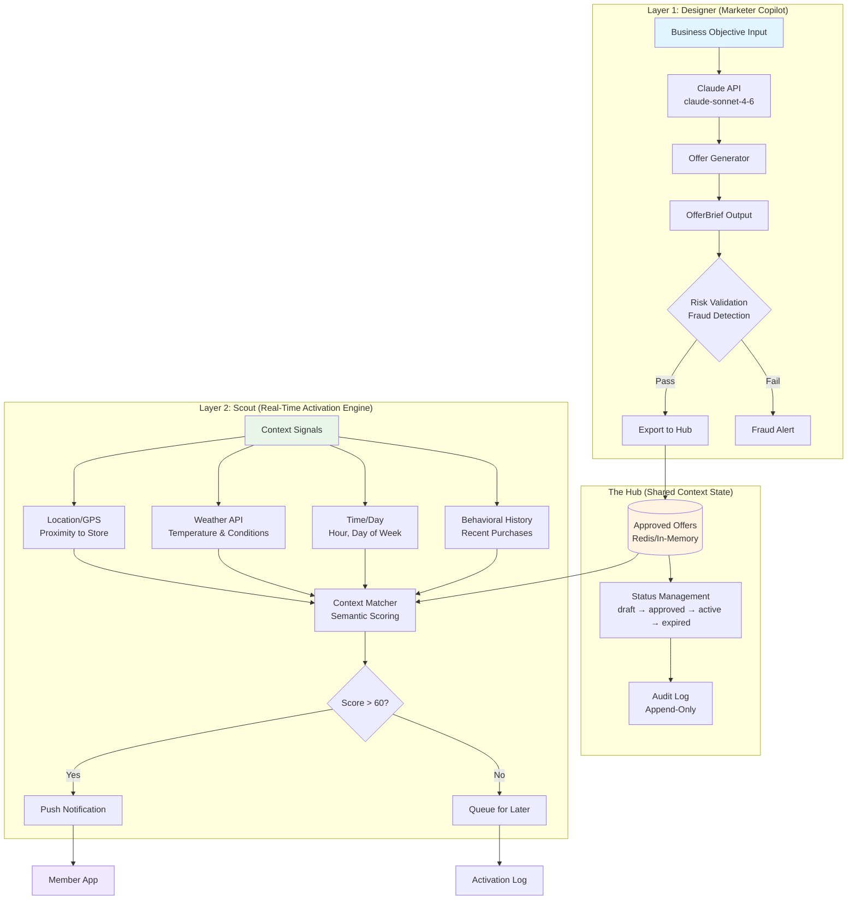
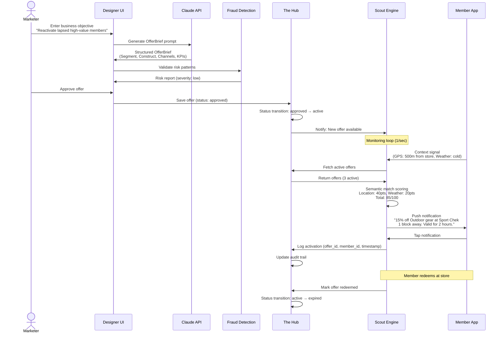
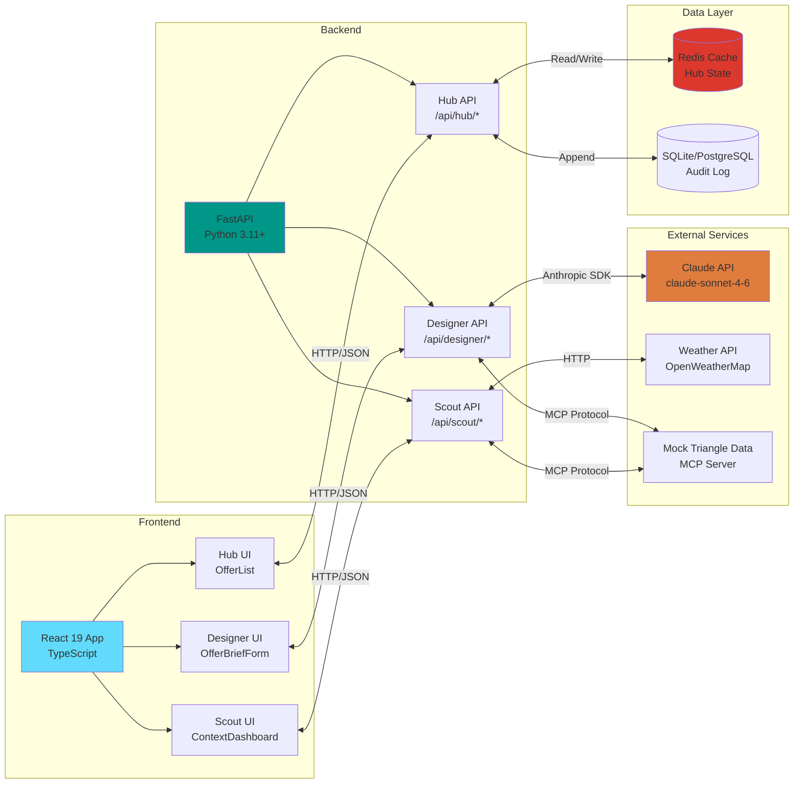
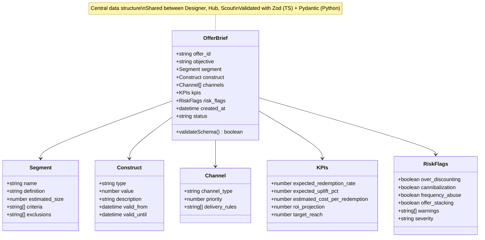
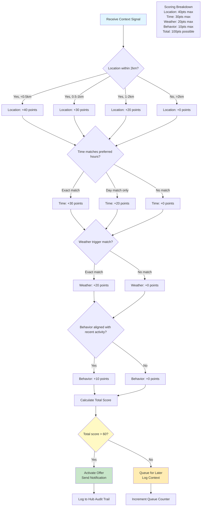
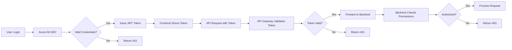
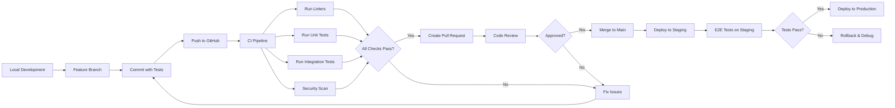

# TriStar Architecture

**Project:** Triangle Smart Targeting and Real-Time Activation
**Hackathon:** CTC True North 2026 (March 9-18)
**Last Updated:** 2026-03-26

---

## Executive Summary

TriStar transforms the Triangle loyalty program from a reactive points ledger into a proactive, AI-powered engagement platform. The system combines intelligent offer design (Designer) with real-time contextual activation (Scout), connected through a shared state (Hub).

**Three Core Layers:**
1. **Designer (Marketer Copilot)** - AI-powered offer design generating OfferBriefs from business objectives
2. **The Hub (Shared Context State)** - Central repository for approved offers ready for activation
3. **Scout (Real-Time Activation Engine)** - Context-aware delivery system monitoring GPS, weather, time, and behavior

---

## System Overview

---

## End-to-End Flow

---

## Component Architecture

---

## Data Flow: OfferBrief Schema

---

## Context Matching Algorithm

---

## Deployment Architecture

```mermaid
graph TB
    subgraph "GitHub"
        A[GitHub Repository<br/>tristar-hackathon]
        B[GitHub Actions<br/>CI/CD Pipeline]
    end

    subgraph "Azure Cloud"
        subgraph "Compute"
            C[App Service<br/>React Frontend]
            D[Azure Functions<br/>FastAPI Backend]
        end

        subgraph "Data & Cache"
            E[Azure Redis Cache<br/>Hub State]
            F[Azure SQL Database<br/>Audit Log]
        end

        subgraph "Monitoring & Secrets"
            G[Application Insights<br/>Telemetry & Logs]
            H[Key Vault<br/>Secrets Management]
        end

        subgraph "Networking"
            I[Azure CDN<br/>Static Assets]
            J[API Management<br/>Rate Limiting & Auth]
        end
    end

    K[External APIs]
    L[Claude API]
    M[Weather API]

    A --> B
    B -->|Deploy Frontend| C
    B -->|Deploy Backend| D

    C --> I
    C --> J
    D --> J

    D --> E
    D --> F
    D --> H

    C --> G
    D --> G

    J --> L
    J --> M

    K --> L
    K --> M

    style A fill:#181717
    style C fill:#0078d4
    style D fill:#0078d4
    style E fill:#dc382d
    style F fill:#0078d4
    style G fill:#0078d4
    style H fill:#0078d4

    note1[Development:<br/>- Frontend: localhost:3000<br/>- Backend: localhost:8000<br/>- Redis: localhost:6379]

    note2[Production:<br/>- Frontend: https://tristar.azurewebsites.net<br/>- Backend: https://tristar-api.azurefunctions.net<br/>- Redis: tristar-cache.redis.cache.windows.net]
```

---

## Technology Stack

### Frontend
- **Framework:** React 19 (with Server Components)
- **Language:** TypeScript 5.x (strict mode)
- **Styling:** Tailwind CSS or Styled Components
- **State Management:** React Context + `useOptimistic`
- **Data Fetching:** React.use() with Suspense
- **Forms:** React Server Actions
- **Testing:** Jest + React Testing Library
- **Build Tool:** Vite or Next.js 15+

### Backend
- **Framework:** FastAPI 0.110+
- **Language:** Python 3.11+
- **Validation:** Pydantic v2
- **Async Runtime:** asyncio with uvicorn
- **Database:** SQLite (dev), PostgreSQL (prod)
- **Cache:** Redis 7.x
- **Testing:** Pytest + httpx
- **Logging:** loguru

### AI & External Services
- **LLM:** Claude API (claude-sonnet-4-6)
- **Weather:** OpenWeatherMap API
- **Mock Data:** MCP Server (@tristar/mock-triangle-data)

### Infrastructure
- **Cloud:** Microsoft Azure
- **Compute:** App Service (frontend), Azure Functions (backend)
- **Data:** Azure Redis Cache, Azure SQL Database
- **Monitoring:** Application Insights
- **Secrets:** Azure Key Vault
- **CI/CD:** GitHub Actions
- **IaC:** Terraform

---

## Security Architecture

### Authentication & Authorization

### Data Flow Security
- **In Transit:** TLS 1.3 for all HTTP traffic
- **At Rest:** Azure Storage encryption (256-bit AES)
- **Secrets:** Azure Key Vault with managed identities
- **PII Handling:** Log member_id only, no names/emails/addresses
- **Rate Limiting:** 100 requests/min per IP (API Management)

---

## Performance Metrics

| Metric | Target | Measurement Method |
|--------|--------|-------------------|
| API Response Time (p95) | <200ms | Application Insights |
| Frontend Page Load | <2s (FCP) | Lighthouse CI |
| Context Matching Latency | <500ms | Custom timer |
| Cache Hit Rate | >80% | Redis INFO stats |
| Offer Generation Time | <5s | Claude API latency |

---

## Scalability Considerations

### Current Scale (Hackathon Demo)
- **Users:** ~100 concurrent demo users
- **Offers:** ~1,000 active offers in Hub
- **Context Signals:** ~10 signals/sec
- **Notifications:** ~5 notifications/sec

### Production Scale (Future)
- **Users:** 10M+ Triangle members
- **Offers:** 100K+ active offers
- **Context Signals:** 10K signals/sec
- **Notifications:** 1K notifications/sec

### Scaling Strategy
1. **Horizontal Scaling:** Azure Functions auto-scale based on queue depth
2. **Caching:** Redis cluster with read replicas
3. **Database:** Sharding by member_id (10M members = 10 shards)
4. **CDN:** Azure CDN for static assets and API responses
5. **Async Processing:** Queue context signals, process in batches

---

## Development Workflow

---

## Monitoring & Observability

### Metrics to Track
1. **Business Metrics:**
   - Offer generation rate (offers/hour)
   - Activation rate (notifications/hour)
   - Redemption rate (redeemed/activated)
   - ROI per offer (revenue - cost)

2. **Technical Metrics:**
   - API latency (p50, p95, p99)
   - Error rate (5xx responses)
   - Cache hit rate
   - Database query time

3. **User Experience:**
   - Frontend page load time
   - Time to interactive (TTI)
   - Notification delivery success rate

### Dashboards
- **Application Insights:** Real-time telemetry, logs, traces
- **Grafana:** Custom dashboards for business metrics
- **Azure Monitor:** Infrastructure health, resource utilization

---

## Disaster Recovery

### Backup Strategy
- **Redis:** Daily snapshots to Azure Blob Storage
- **SQL Database:** Automated backups (7-day retention)
- **Code:** Git repository (multiple remotes)

### Recovery Time Objectives (RTO)
- **Database Failure:** <15 minutes (restore from backup)
- **Redis Failure:** <5 minutes (failover to replica)
- **Complete Region Failure:** <4 hours (redeploy to new region)

---

## Future Enhancements

### Phase 2 (Post-Hackathon)
- **Machine Learning:** Predictive context matching using historical data
- **A/B Testing:** Experimentation framework for offer variants
- **Multi-Language:** French language support for Quebec members
- **Partner Integration:** Real-time inventory sync with stores

### Phase 3 (Production)
- **Mobile Apps:** Native iOS/Android apps with offline support
- **Voice Activation:** Integration with Alexa/Google Assistant
- **Blockchain:** Immutable audit trail for compliance
- **AI Agents:** Multi-agent orchestration for complex campaigns

---

**Document Version:** 1.0
**Generated:** 2026-03-26
**Maintainers:** TriStar Hackathon Team