# TriStar Architecture

**Project:** Triangle Smart Targeting and Real-Time Activation
**Hackathon:** CTC True North 2026 (March 9-18)
**Last Updated:** 2026-04-05

---

## Executive Summary

TriStar transforms the Triangle loyalty program from a reactive points ledger into a proactive, AI-powered engagement platform. The system combines intelligent offer design (Designer) with real-time contextual activation (Scout), connected through a shared state (Hub).

**Three Core Layers:**
1. **Designer (Marketer Copilot)** - AI-powered offer design generating OfferBriefs from business objectives
2. **The Hub (Shared Context State)** - Central repository for approved offers ready for activation
3. **Scout (Real-Time Activation Engine)** - Context-aware delivery system monitoring GPS, weather, time, and behavior

**Three Offer Trigger Types:**
- `marketer_initiated` — Marketer creates via Designer UI (draft → approved → active flow)
- `purchase_triggered` — Auto-generated when a Triangle purchase webhook arrives at Scout
- `partner_triggered` — Auto-generated when a partner purchase event (e.g. Tim Hortons) arrives

---

## System Overview

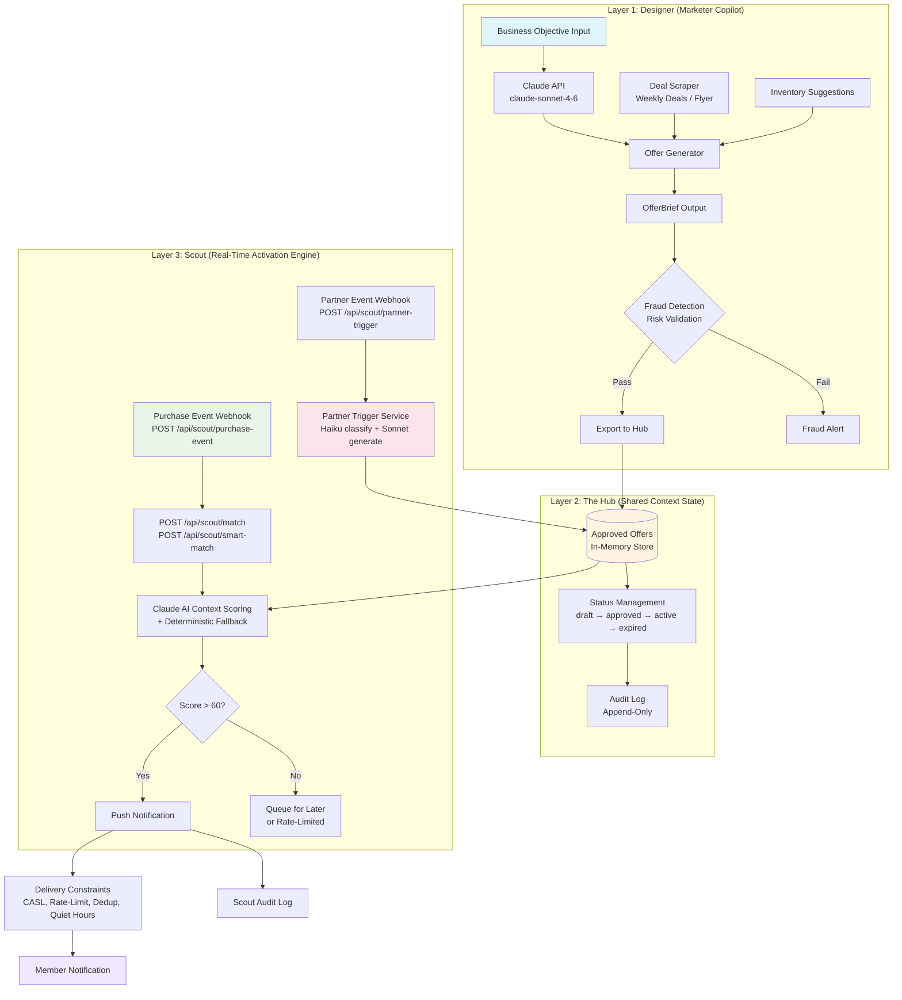

---

## End-to-End Flow: Marketer-Initiated Offer

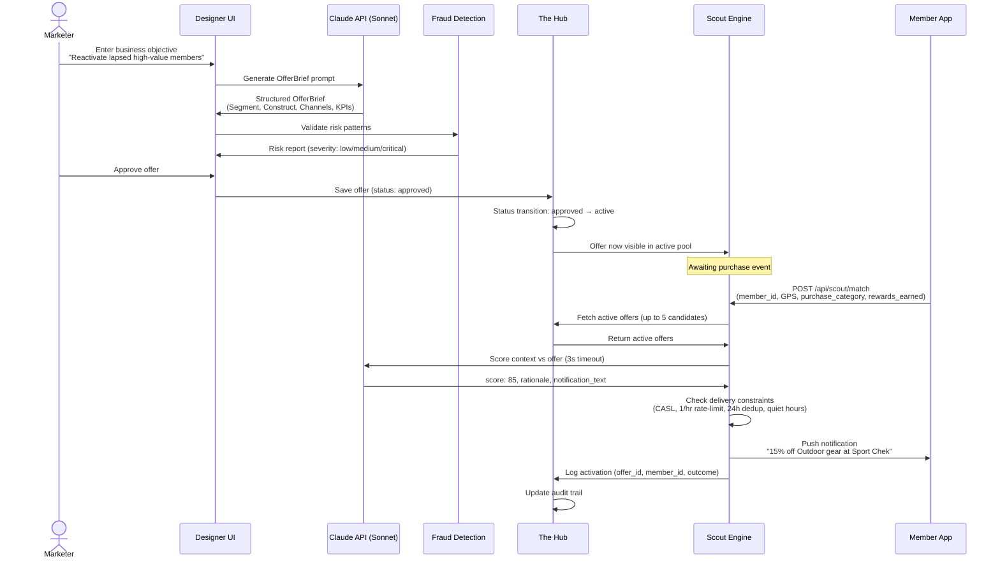

---

## End-to-End Flow: Purchase-Triggered Offer

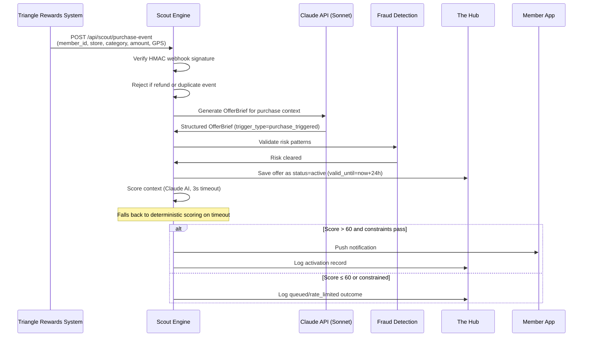

---

## End-to-End Flow: Partner-Triggered Offer (Tim Hortons)

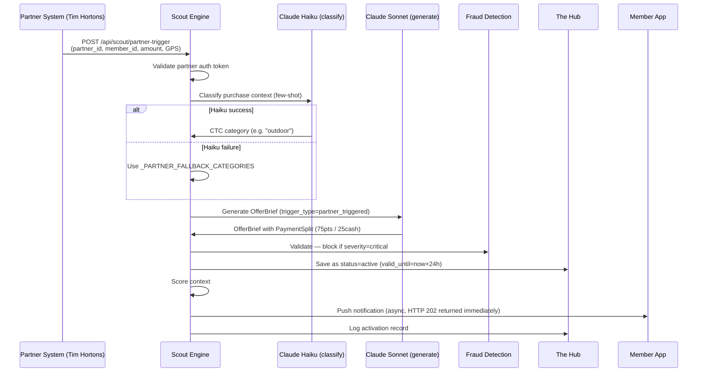

---

## Smart Match — Multi-Offer Response

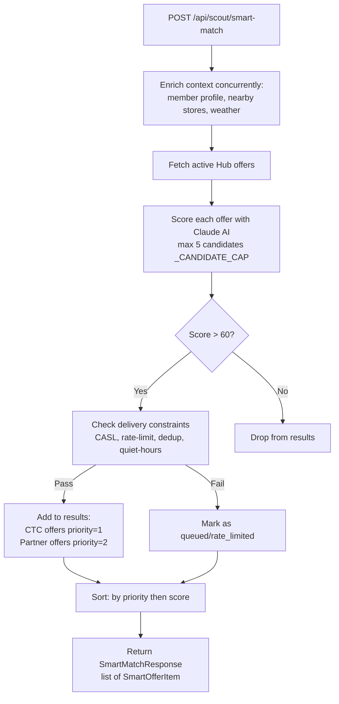

---

## Context Matching Algorithm (Claude AI + Deterministic Fallback)

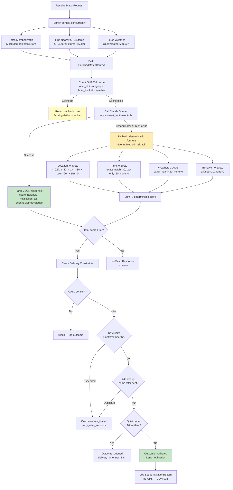

---

## Component Architecture

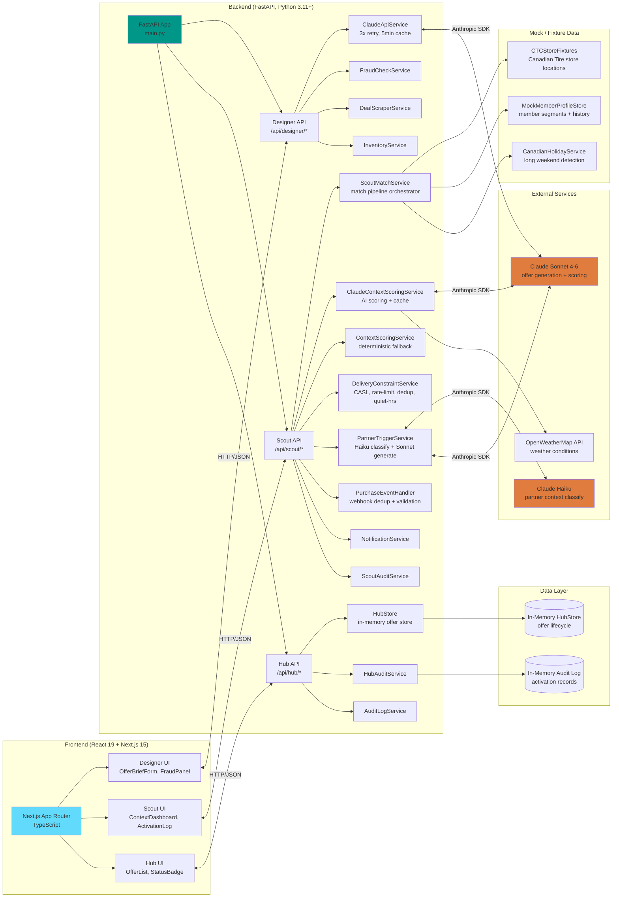

---

## OfferBrief Schema

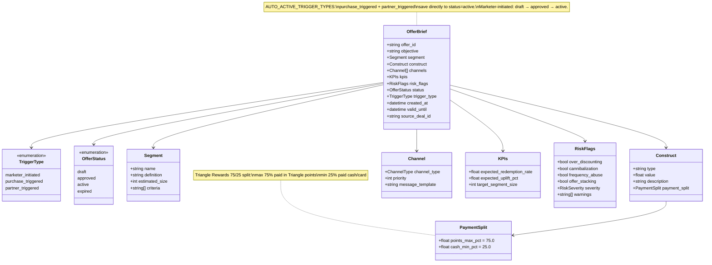

---

## Hub Offer Lifecycle

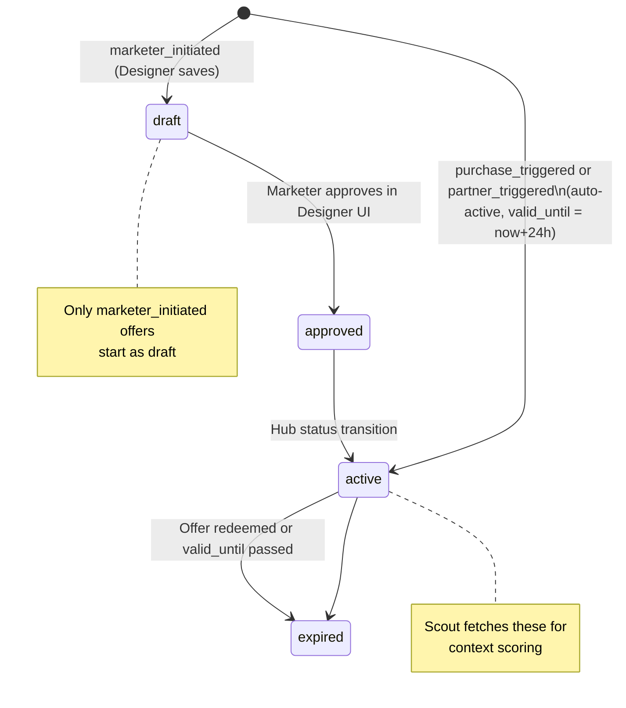

---

## Scout API Endpoints

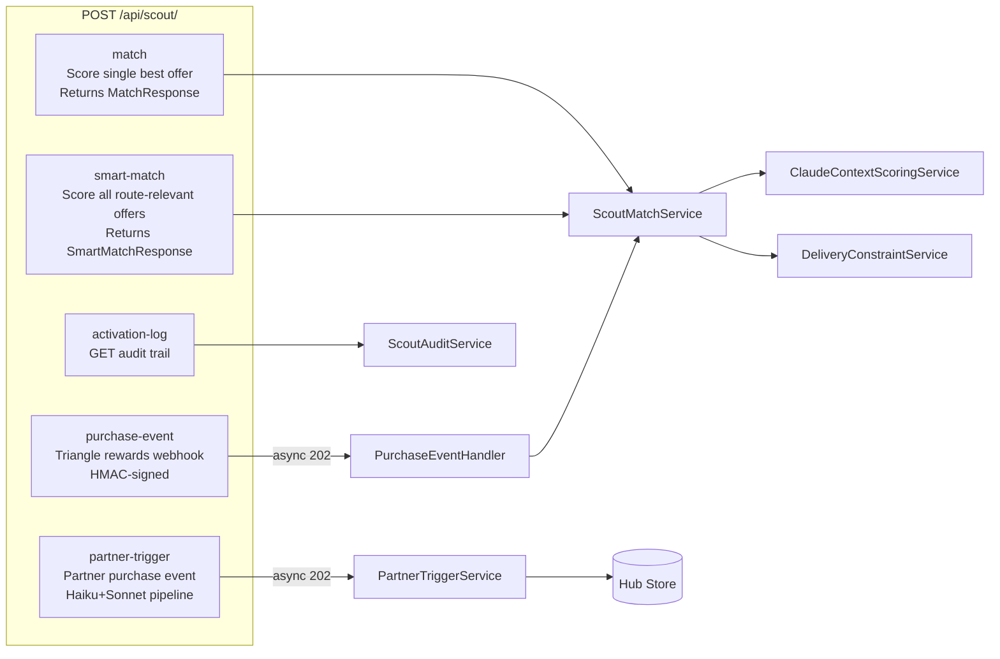

---

## Security Architecture

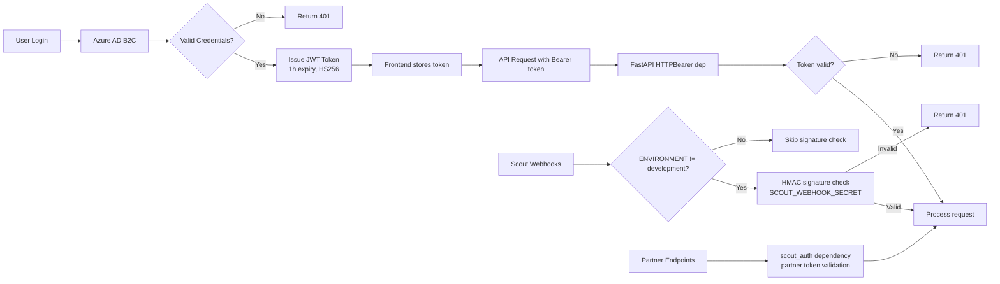

**Auth Notes:**
- Hub GET endpoints are **public** (no auth required) — read-only offer browsing
- Designer mutation endpoints require JWT
- Scout webhooks use HMAC signature verification (skipped in `development` env)
- Partner trigger endpoints use per-partner token auth via `scout_auth` dependency

---

## Deployment Architecture

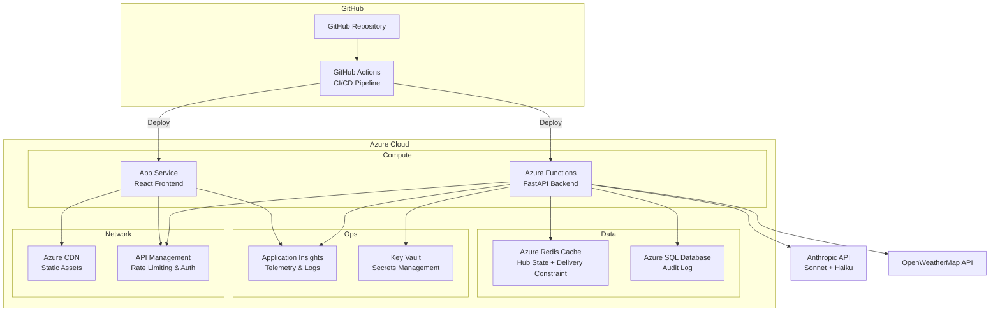

---

## Technology Stack

### Frontend
- **Framework:** React 19 + Next.js 15 (App Router)
- **Language:** TypeScript 5.x (strict mode)
- **Styling:** Tailwind CSS
- **State:** React Context + `useOptimistic`
- **Data Fetching:** React.use() with Suspense
- **Forms:** React Server Actions
- **Testing:** Jest + React Testing Library

### Backend
- **Framework:** FastAPI 0.110+
- **Language:** Python 3.11+
- **Validation:** Pydantic v2
- **Async:** asyncio with uvicorn
- **Data Store:** In-memory dict (Hub), dev; Redis (prod)
- **Testing:** Pytest + httpx AsyncClient
- **Logging:** loguru (structured JSON)

### AI & External Services
- **Offer generation:** Claude Sonnet 4-6 (Designer + Scout purchase/partner triggers)
- **Partner classification:** Claude Haiku (fast few-shot classification)
- **Context scoring:** Claude Sonnet 4-6 with 3s timeout + deterministic fallback
- **Weather:** OpenWeatherMap API

---

## Performance Metrics

| Metric | Target | Notes |
|--------|--------|-------|
| API Response Time (p95) | <200ms | Application Insights |
| Frontend Page Load | <2s (FCP) | Lighthouse CI |
| Scout context scoring | <3s | Claude timeout budget |
| Cache Hit Rate | >80% | 3-hour bucket SHA256 cache |
| Offer Generation Time | <5s | Claude Sonnet p95 |

---

## Development Workflow

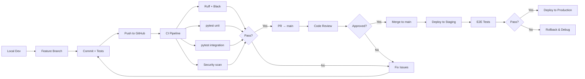

---

**Document Version:** 2.0
**Generated:** 2026-04-05
**Maintainers:** TriStar Hackathon Team
